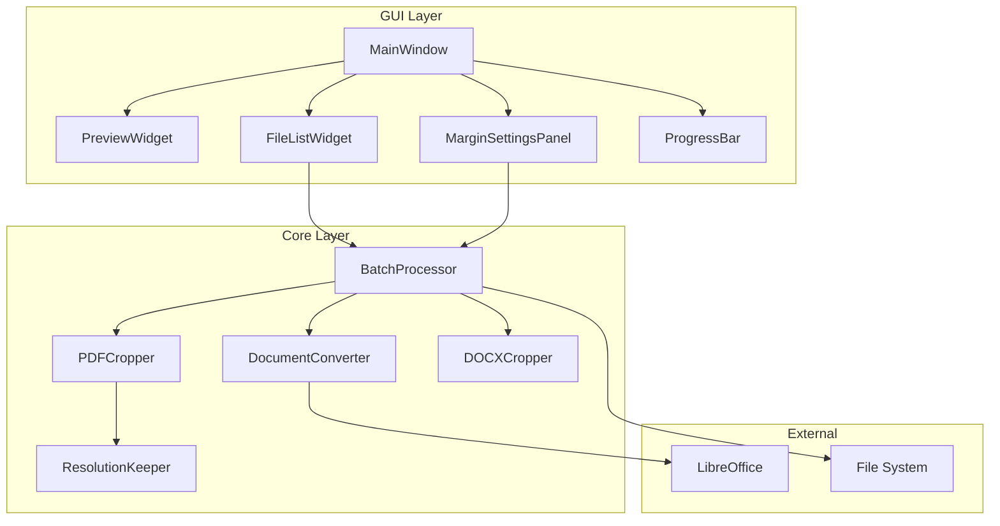
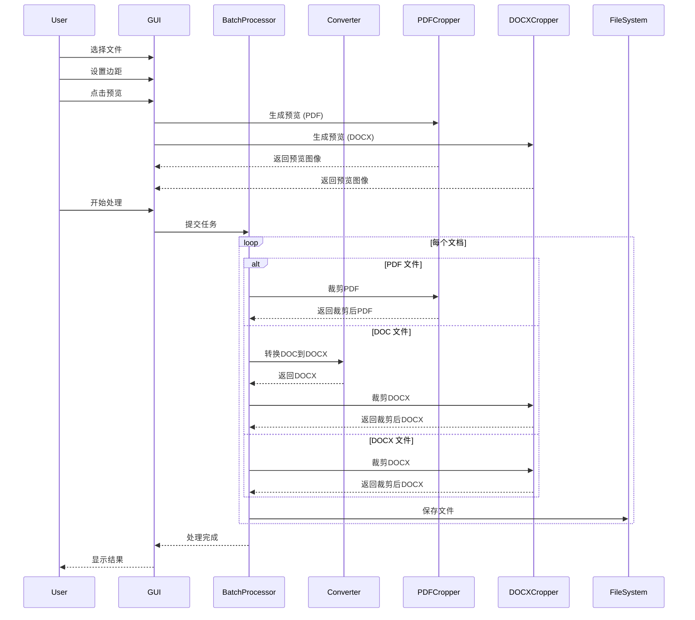

# Design Document: Batch Document Cropper

## Overview

本设计文档描述了一款基于 Python 的批量文档裁剪桌面工具的技术架构和实现方案。该工具支持 PDF 和 DOCX/DOC 文档的裁剪，保持原始文件格式输出。PDF 使用 PyMuPDF 进行裁剪，DOCX 通过调整页面边距实现裁剪，DOC 先转换为 DOCX 再处理。

### 技术栈选择

- **GUI 框架**: PyQt5 - 成熟的跨平台 GUI 框架
- **PDF 处理**: PyMuPDF (fitz) - 高性能 PDF 处理库，支持裁剪和预览
- **DOCX 处理**: python-docx - DOCX 文档操作库，用于调整页面边距
- **文档转换**: LibreOffice (通过 subprocess 调用) - DOC 到 DOCX 的高保真转换
- **打包工具**: PyInstaller - 将 Python 应用打包为独立 EXE
- **并发处理**: concurrent.futures - Python 标准库并发模块

## Architecture



### 数据流



## Components and Interfaces

### 1. MainWindow (主窗口)

```python
class MainWindow(QMainWindow):
    """主窗口类，管理整体 UI 布局和用户交互"""
    
    def __init__(self):
        """初始化主窗口"""
        pass
    
    def add_files(self, file_paths: List[str]) -> bool:
        """添加文件到处理队列
        
        Args:
            file_paths: 文件路径列表
            
        Returns:
            是否成功添加
        """
        pass
    
    def start_processing(self) -> None:
        """开始批量处理"""
        pass
    
    def update_progress(self, file_name: str, progress: int) -> None:
        """更新处理进度
        
        Args:
            file_name: 当前处理的文件名
            progress: 进度百分比 (0-100)
        """
        pass
```

### 2. MarginSettings (边距设置)

```python
@dataclass
class MarginSettings:
    """边距设置数据类"""
    top: float      # 上边距 (mm)
    bottom: float   # 下边距 (mm)
    left: float     # 左边距 (mm)
    right: float    # 右边距 (mm)
    
    def validate(self) -> Tuple[bool, str]:
        """验证边距设置是否有效
        
        Returns:
            (是否有效, 错误信息)
        """
        pass
    
    def to_points(self) -> Tuple[float, float, float, float]:
        """将毫米转换为 PDF 点数 (1 inch = 72 points)
        
        Returns:
            (top_pt, bottom_pt, left_pt, right_pt)
        """
        pass
```

### 3. DocumentConverter (文档转换器)

```python
class DocumentConverter:
    """文档格式转换器，使用 LibreOffice 进行 DOC 到 DOCX 转换"""
    
    def __init__(self, libreoffice_path: str = None):
        """初始化转换器
        
        Args:
            libreoffice_path: LibreOffice 可执行文件路径
        """
        pass
    
    def convert_doc_to_docx(self, input_path: str, output_dir: str) -> str:
        """将 DOC 转换为 DOCX
        
        Args:
            input_path: 输入 DOC 文件路径
            output_dir: 输出目录
            
        Returns:
            转换后的 DOCX 文件路径
            
        Raises:
            ConversionError: 转换失败时抛出
        """
        pass
    
    def is_doc_file(self, file_path: str) -> bool:
        """判断文件是否为 DOC 格式
        
        Args:
            file_path: 文件路径
            
        Returns:
            是否为 DOC 文件
        """
        pass
```

### 5. PDFCropper (PDF 裁剪器)

```python
class PDFCropper:
    """PDF 裁剪核心类"""
    
    def __init__(self):
        """初始化裁剪器"""
        pass
    
    def crop(self, input_path: str, output_path: str, 
             margins: MarginSettings) -> CropResult:
        """裁剪 PDF 文件
        
        Args:
            input_path: 输入 PDF 路径
            output_path: 输出 PDF 路径
            margins: 边距设置
            
        Returns:
            裁剪结果对象
        """
        pass
    
    def generate_preview(self, input_path: str, page_num: int,
                         margins: MarginSettings) -> QImage:
        """生成带裁剪边界的预览图像
        
        Args:
            input_path: PDF 文件路径
            page_num: 页码 (从0开始)
            margins: 边距设置
            
        Returns:
            预览图像
        """
        pass
    
    def get_page_count(self, input_path: str) -> int:
        """获取 PDF 页数
        
        Args:
            input_path: PDF 文件路径
            
        Returns:
            页数
        """
        pass
```

### 6. BatchProcessor (批量处理器)

```python
class BatchProcessor(QObject):
    """批量处理器，管理多文档并发处理"""
    
    # Qt 信号
    progress_updated = pyqtSignal(str, int)  # (文件名, 进度)
    file_completed = pyqtSignal(str, bool, str)  # (文件名, 是否成功, 消息)
    all_completed = pyqtSignal(int, int)  # (成功数, 失败数)
    
    def __init__(self, max_workers: int = 5):
        """初始化批量处理器
        
        Args:
            max_workers: 最大并发数
        """
        pass
    
    def add_task(self, file_path: str, margins: MarginSettings,
                 output_dir: str) -> None:
        """添加处理任务
        
        Args:
            file_path: 文件路径
            margins: 边距设置
            output_dir: 输出目录
        """
        pass
    
    def start(self) -> None:
        """开始处理所有任务
        
        处理逻辑:
        - PDF 文件: 直接使用 PDFCropper 裁剪，输出 PDF
        - DOCX 文件: 使用 DOCXCropper 裁剪，输出 DOCX
        - DOC 文件: 先转换为 DOCX，再裁剪，输出 DOCX
        """
        pass
    
    def cancel(self) -> None:
        """取消处理"""
        pass
```

### 7. ResolutionKeeper (分辨率保持器)

```python
class ResolutionKeeper:
    """分辨率保持模块"""
    
    @staticmethod
    def get_pdf_resolution(pdf_path: str) -> Dict[str, int]:
        """获取 PDF 中图像的分辨率信息
        
        Args:
            pdf_path: PDF 文件路径
            
        Returns:
            分辨率信息字典
        """
        pass
    
    @staticmethod
    def verify_resolution(original_path: str, processed_path: str) -> bool:
        """验证处理后的分辨率是否保持
        
        Args:
            original_path: 原始文件路径
            processed_path: 处理后文件路径
            
        Returns:
            分辨率是否保持
        """
        pass
```

## Data Models

### ProcessingTask (处理任务)

```python
@dataclass
class ProcessingTask:
    """处理任务数据模型"""
    id: str                     # 任务唯一标识
    input_path: str             # 输入文件路径
    output_path: str            # 输出文件路径
    margins: MarginSettings     # 边距设置
    status: TaskStatus          # 任务状态
    progress: int               # 进度 (0-100)
    error_message: str = ""     # 错误信息
    
class TaskStatus(Enum):
    """任务状态枚举"""
    PENDING = "pending"
    CONVERTING = "converting"
    CROPPING = "cropping"
    COMPLETED = "completed"
    FAILED = "failed"
```

### CropResult (裁剪结果)

```python
@dataclass
class CropResult:
    """裁剪结果数据模型"""
    success: bool               # 是否成功
    input_path: str             # 输入路径
    output_path: str            # 输出路径
    pages_processed: int        # 处理的页数
    original_resolution: int    # 原始分辨率
    output_resolution: int      # 输出分辨率
    error_message: str = ""     # 错误信息
```

### ProcessingSummary (处理摘要)

```python
@dataclass
class ProcessingSummary:
    """批量处理摘要"""
    total_files: int            # 总文件数
    successful: int             # 成功数
    failed: int                 # 失败数
    failed_files: List[str]     # 失败的文件列表
    total_time: float           # 总耗时 (秒)
```


## Correctness Properties

*A property is a characteristic or behavior that should hold true across all valid executions of a system—essentially, a formal statement about what the system should do. Properties serve as the bridge between human-readable specifications and machine-verifiable correctness guarantees.*

### Property 1: File Format Validation

*For any* file path, the system should accept the file if and only if its extension is one of `.pdf`, `.docx`, or `.doc` (case-insensitive), and should return an appropriate error message for all other extensions.

**Validates: Requirements 1.1, 1.3**

### Property 2: Margin Settings Validation and Independence

*For any* set of four numeric values (top, bottom, left, right), the MarginSettings should:
- Accept all non-negative numeric values
- Reject negative values with appropriate error messages
- Store each margin value independently (changing one does not affect others)

**Validates: Requirements 2.2, 2.3, 2.4**

### Property 3: Margin Unit Conversion Round-Trip

*For any* valid MarginSettings in millimeters, converting to points and back to millimeters should produce values within acceptable floating-point tolerance of the original values.

**Validates: Requirements 2.2**

### Property 4: Preview Generation Consistency

*For any* valid PDF document and page number within bounds, the preview engine should generate a non-null image. For the same document, margins, and page number, repeated preview generation should produce identical results.

**Validates: Requirements 3.1, 3.2, 3.4**

### Property 5: Batch Processing with Failure Isolation

*For any* batch of documents containing both valid and invalid files, the batch processor should:
- Attempt to process all documents
- Successfully process all valid documents
- Report failures for invalid documents without affecting valid ones
- Return a summary with correct success/failure counts

**Validates: Requirements 4.1, 4.3, 4.4**

### Property 6: Resolution Preservation Invariant

*For any* PDF document with embedded images, after cropping, the output document's image resolution (DPI) should be greater than or equal to the input document's image resolution.

**Validates: Requirements 6.1, 6.2, 6.4**

### Property 7: Output Format Preservation

*For any* input file, the output file format should match the input format:
- PDF input → PDF output
- DOCX input → DOCX output
- DOC input → DOCX output (after conversion)

**Validates: Requirements 7.4, 7.5, 7.6, 7.7**

### Property 8: Output Filename Pattern Preservation

*For any* input filename and configurable suffix, the output filename should equal the original filename (without extension) concatenated with the suffix and the appropriate extension based on input format.

**Validates: Requirements 7.2**

### Property 9: Cropping Accuracy Across Page Sizes

*For any* PDF document with varying page sizes and any valid margin settings, the cropper should apply the exact margin values (converted to points) to each page, resulting in a new page size that equals the original size minus the specified margins.

**Validates: Requirements 11.1, 11.3**

### Property 10: Processing Idempotence

*For any* document and margin settings, processing the same document twice with the same settings should produce byte-identical output files.

**Validates: Requirements 11.2**

### Property 11: Queue Size Limit Enforcement

*For any* attempt to add more than 5 documents to the processing queue, the system should either reject the excess documents or queue them for later processing, never exceeding 5 concurrent processing tasks.

**Validates: Requirements 1.2, 4.1**

### Property 12: DOCX Margin Adjustment Accuracy

*For any* DOCX document and valid margin settings, the DOCXCropper should adjust page margins to the exact values specified, and the adjustment should apply to all sections in the document.

**Validates: Requirements 10.1, 10.4**

### Property 13: DOCX Content Preservation

*For any* DOCX document, after cropping (margin adjustment), all original content including text, images, tables, and formatting styles should be preserved unchanged.

**Validates: Requirements 10.2, 10.3**

### Property 14: DOC to DOCX Conversion Fidelity

*For any* DOC document, after conversion to DOCX, the text layout, font types, sizes, headers, footers, and page margins should be preserved.

**Validates: Requirements 5.1, 5.2, 5.3, 5.4**

## Error Handling

### 错误类型定义

```python
class CropperError(Exception):
    """基础异常类"""
    pass

class FileFormatError(CropperError):
    """文件格式错误"""
    def __init__(self, file_path: str, extension: str):
        self.file_path = file_path
        self.extension = extension
        super().__init__(f"Unsupported file format: {extension}. Supported formats: PDF, DOCX, DOC")

class ConversionError(CropperError):
    """文档转换错误"""
    def __init__(self, file_path: str, reason: str):
        self.file_path = file_path
        self.reason = reason
        super().__init__(f"Failed to convert {file_path}: {reason}")

class CropError(CropperError):
    """裁剪错误"""
    def __init__(self, file_path: str, reason: str):
        self.file_path = file_path
        self.reason = reason
        super().__init__(f"Failed to crop {file_path}: {reason}")

class MarginValidationError(CropperError):
    """边距验证错误"""
    def __init__(self, field: str, value: float, reason: str):
        self.field = field
        self.value = value
        self.reason = reason
        super().__init__(f"Invalid margin value for {field}: {value}. {reason}")

class OutputError(CropperError):
    """输出错误"""
    def __init__(self, output_path: str, reason: str):
        self.output_path = output_path
        self.reason = reason
        super().__init__(f"Failed to save to {output_path}: {reason}")
```

### 错误处理策略

1. **文件格式错误**: 在文件选择时立即验证，阻止无效文件进入队列
2. **转换错误**: 记录错误，跳过该文件，继续处理其他文件
3. **裁剪错误**: 记录错误，保留原始文件，报告失败
4. **边距验证错误**: 在用户输入时实时验证，阻止无效值提交
5. **输出错误**: 提示用户检查输出目录权限，提供重试选项

## Testing Strategy

### 测试框架选择

- **单元测试**: pytest
- **属性测试**: hypothesis (Python 属性测试库)
- **GUI 测试**: pytest-qt

### 单元测试

单元测试用于验证特定示例和边界情况：

1. **MarginSettings 测试**
   - 测试有效边距值的创建
   - 测试边界值 (0, 最大值)
   - 测试无效值的错误处理

2. **DocumentConverter 测试**
   - 测试 DOC 到 PDF 转换
   - 测试 DOCX 到 PDF 转换
   - 测试 LibreOffice 不可用时的错误处理

3. **PDFCropper 测试**
   - 测试单页 PDF 裁剪
   - 测试多页 PDF 裁剪
   - 测试预览生成

4. **BatchProcessor 测试**
   - 测试单文件处理
   - 测试多文件并发处理
   - 测试取消操作

### 属性测试配置

```python
from hypothesis import given, settings, strategies as st

# 每个属性测试至少运行 100 次迭代
@settings(max_examples=100)
```

### 属性测试实现要求

每个正确性属性必须实现为单独的属性测试：

1. **Property 1**: 文件格式验证 - 生成随机文件扩展名，验证接受/拒绝行为
2. **Property 2**: 边距验证 - 生成随机数值，验证验证逻辑
3. **Property 3**: 单位转换 - 生成随机毫米值，验证往返转换
4. **Property 4**: 预览一致性 - 使用测试 PDF，验证重复生成一致性
5. **Property 5**: 批处理隔离 - 生成有效/无效文件混合，验证隔离
6. **Property 6**: 分辨率保持 - 使用测试 PDF，验证 DPI 不降低
7. **Property 7**: 输出格式保持 - 验证 PDF→PDF, DOCX→DOCX, DOC→DOCX
8. **Property 8**: 文件名模式 - 生成随机文件名和后缀，验证输出模式
9. **Property 9**: 裁剪精度 - 生成随机边距，验证页面尺寸变化
10. **Property 10**: 幂等性 - 重复处理同一文件，验证输出一致
11. **Property 11**: 队列限制 - 生成超过限制的任务数，验证限制执行
12. **Property 12**: DOCX 边距调整精度 - 验证边距设置正确应用到所有节
13. **Property 13**: DOCX 内容保持 - 验证裁剪后内容完整性
14. **Property 14**: DOC 转换保真 - 验证 DOC 到 DOCX 转换的布局保持

### 测试标注格式

每个属性测试必须包含以下标注：

```python
# Feature: batch-document-cropper, Property 1: File Format Validation
# Validates: Requirements 1.1, 1.3
```

### 集成测试

使用真实的测试文档验证端到端流程：

1. 准备测试文档集 (PDF, DOCX, DOC)
2. 执行完整的导入-设置-预览-处理-保存流程
3. 验证输出文档的格式保真和分辨率保持
