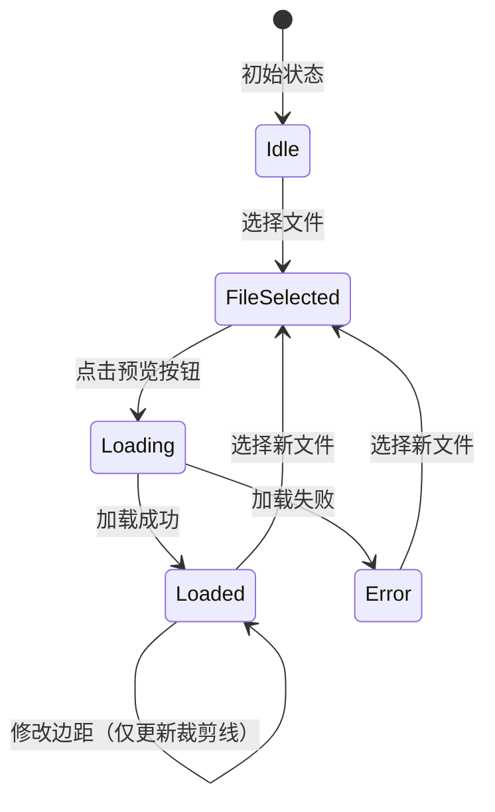
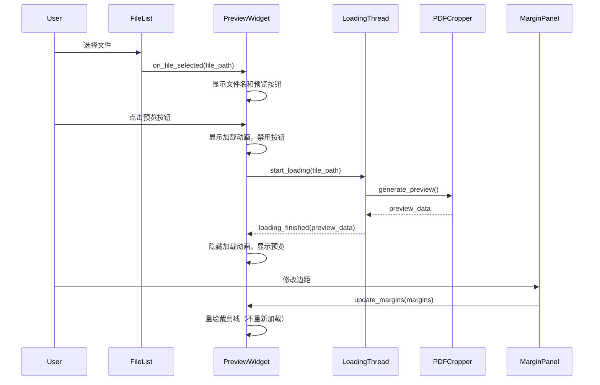

# Design Document: Preview Button Loading

## Overview

本设计文档描述了文档预览功能的用户体验改进方案。通过将自动预览改为手动触发，并添加加载动画，提升用户在处理大文档或需要格式转换时的体验。

### 技术方案

- 在预览区域添加"预览"按钮
- 使用 QThread 在后台线程加载预览，避免阻塞 UI
- 使用 QMovie 或自定义动画显示加载状态
- 保持现有的边距更新逻辑（仅重绘裁剪线）

## Architecture



### 组件交互



## Components and Interfaces

### 1. PreviewWidget (更新)

```python
class PreviewWidget(QWidget):
    """预览组件 - 更新版"""
    
    class State(Enum):
        IDLE = "idle"           # 初始状态，无文件选中
        FILE_SELECTED = "file_selected"  # 文件已选中，等待预览
        LOADING = "loading"     # 正在加载预览
        LOADED = "loaded"       # 预览已加载
        ERROR = "error"         # 加载失败
    
    def __init__(self):
        """初始化预览组件"""
        pass
    
    def on_file_selected(self, file_path: str, margins: MarginSettings) -> None:
        """文件选中时调用
        
        Args:
            file_path: 选中的文件路径
            margins: 当前边距设置
            
        行为:
            - 保存文件路径和边距设置
            - 显示文件名
            - 显示预览按钮
            - 不自动加载预览
        """
        pass
    
    def start_preview(self) -> None:
        """开始加载预览
        
        行为:
            - 显示加载动画
            - 禁用预览按钮
            - 启动后台加载线程
        """
        pass
    
    def update_margins(self, margins: MarginSettings) -> None:
        """更新边距设置
        
        Args:
            margins: 新的边距设置
            
        行为:
            - 如果预览已加载，仅重绘裁剪线
            - 如果预览未加载，仅保存边距设置
            - 不触发预览加载
            - 不显示加载动画
        """
        pass
```

### 2. PreviewLoadingThread (新增)

```python
class PreviewLoadingThread(QThread):
    """预览加载线程"""
    
    # 信号
    loading_finished = pyqtSignal(bytes, float, float)  # (图像数据, 页面宽度, 页面高度)
    loading_failed = pyqtSignal(str)  # 错误信息
    
    def __init__(self, file_path: str, page_num: int, scale: float):
        """初始化加载线程
        
        Args:
            file_path: 文件路径
            page_num: 页码
            scale: 缩放比例
        """
        pass
    
    def run(self) -> None:
        """执行加载
        
        行为:
            - 如果是 Word 文档，先转换为 PDF
            - 生成预览图像
            - 发送完成或失败信号
        """
        pass
```

### 3. LoadingIndicator (新增)

```python
class LoadingIndicator(QWidget):
    """加载指示器组件"""
    
    def __init__(self):
        """初始化加载指示器"""
        pass
    
    def start(self) -> None:
        """开始显示加载动画"""
        pass
    
    def stop(self) -> None:
        """停止加载动画"""
        pass
```

## Data Models

### PreviewState (新增)

```python
class PreviewState(Enum):
    """预览状态枚举"""
    IDLE = "idle"               # 初始状态
    FILE_SELECTED = "file_selected"  # 文件已选中
    LOADING = "loading"         # 加载中
    LOADED = "loaded"           # 已加载
    ERROR = "error"             # 错误
```

## Correctness Properties

*A property is a characteristic or behavior that should hold true across all valid executions of a system—essentially, a formal statement about what the system should do. Properties serve as the bridge between human-readable specifications and machine-verifiable correctness guarantees.*

### Property 1: Margin Update Without Document Reload

*For any* loaded preview and any valid margin change, updating margins should only trigger crop line redrawing without reloading the document from disk or triggering the loading thread.

**Validates: Requirements 3.1**

## Error Handling

### 错误场景

1. **文档转换失败**: 显示错误信息，允许用户重试
2. **预览生成失败**: 显示错误信息，允许用户重试
3. **文件不存在**: 显示错误信息，清除选中状态

### 错误处理策略

```python
def _on_loading_failed(self, error_message: str):
    """加载失败处理"""
    self._state = PreviewState.ERROR
    self._loading_indicator.stop()
    self._preview_btn.setEnabled(True)
    self._error_label.setText(f"预览失败: {error_message}")
    self._error_label.show()
```

## Testing Strategy

### 测试框架

- **单元测试**: pytest
- **GUI 测试**: pytest-qt
- **属性测试**: hypothesis

### 单元测试

1. **状态转换测试**
   - 测试从 IDLE 到 FILE_SELECTED 的转换
   - 测试从 FILE_SELECTED 到 LOADING 的转换
   - 测试从 LOADING 到 LOADED 的转换
   - 测试从 LOADING 到 ERROR 的转换

2. **边距更新测试**
   - 测试已加载状态下边距更新不触发重新加载
   - 测试未加载状态下边距更新不触发加载

### 属性测试配置

```python
from hypothesis import given, settings, strategies as st

@settings(max_examples=100)
```

### 属性测试实现

每个正确性属性必须实现为单独的属性测试：

1. **Property 1**: 边距更新不触发文档重载 - 生成随机边距值，验证更新边距时不触发加载线程

### 测试标注格式

```python
# Feature: preview-button-loading, Property 1: Margin Update Without Document Reload
# Validates: Requirements 3.1
```

